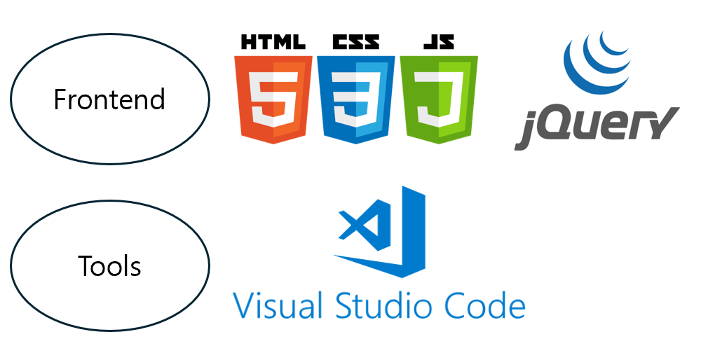

### 목차
> 1. [프로젝트 소개](#프로젝트-소개)   
> 2. [기획 및 설계](#기획-및-설계)   
> 3. [메뉴 관계도](#메뉴-관계도)   
> 4. [기술 스택](#기술-스택)   
> 5. [주요 기능](#주요-기능)   
> 6. [주요 화면](#주요-화면)    

# 프로젝트 소개
> </img> 
> ### 혁신의 미래를 열다, AI Dream 서비스 제공 플랫폼
>
> AI에 관심 있는 사용자의 요구를 반영하여, 다양한 AI 관련 정보를 제공합니다.   
> AI의 기본 개념과 용어 사전을 비롯해 전문 지식과 기업, 채용, 교육, 뉴스 등의 카테고리별 정보를 제공합니다.   
> 사용자는 관심 있는 기업과 채용 게시물을 즐겨찾기에 등록할 수 있으며, 자유 토론을 통해 의견을 공유하고 토론할 수 있는 사용자 친화적 서비스를 제공합니다.   
>
> HTML, CSS, JS를 사용하여 정적 웹사이트 구현하였고   
> JQUERY 를 통해 애니메이션과 여러 이벤트 처리를 구현하였습니다.   
> Backend가 설계되지 않아 모든 정보는 더미 데이터로 직접 작성하였고, 실제로 회원이 생성되지 않습니다.   
> CSS, JS를 적극 활용하여 다양한 스타일과 동작을 주는 것에 중점을 두었습니다다.   
>
> **REFERENCE** [직행](https://zighang.com/ai)

> ### 개발 기간
> 2024.08.01 ~ 2024.08.26

> ### 개발 인원(4명)
> **김준선(FRONTEND)**   
> 기본 폼 설정  
> 메인, 소개, 뉴스, 게시판, 페이징 구현
>
> **김다현(FRONTEND)**   
> 기획, 설계   
> 메인, 로그인, 회원가입, 기업, 채용, 마이페이지 구현 
>
> **김민서(FRONTEND)**   
> PPT, 발표   
> 메인, 뉴스, 게시판 구현
> 
> **문성준(FRONTEND)**   
> 동영상 제작   
> 메인, 교육 구현

# 기획 및 설계
</img> 

# 메뉴 관계도
</img>  

# 기술 스택
</img> 

# 주요 기능
### 요약
|공통|사용자|
|------|---|
|-회원가입, 로그인 -소개 -기업 -채용 -교육 -뉴스 -게시판 조회|-마이페이지|

## [공통 기능]
### 회원가입, 로그인
* 아이디, 비밀번호, 이름을 필수로 입력해야 하며 비밀번호 확인을 통해 일치여부를 검사한다.
* 이메일의 직접입력을 선택하면 입력칸이 활성화 된다.
* 전화번호 입력 시 자릿수에 따라 하이픈이 자동 추가된다.
### 메인
* 로그인을 하면 아이디가 화면에 표기되고 마이페이지로 이동할 수 있다.
* 메뉴에 마우스를 올리면 애니메이션과 함께 세부 메뉴가 열린다.
### 소개
* 특정 단어의 돋보기를 누르면 해당 단어의 용어사전 페이지로 이동한다. 
### 기업, 채용
* 카테고리 별로 특정 정보를 조회할 수 있다.
* 즐겨찾기 별을 누를때마다다 색이 바뀐다.
* 화면 크기에 따라 목록들의 나열이 바뀌는 반응형을 적용했다. 
### 교육
* 검색을 통해 원하는 교육 정보를 조회할 수 있다.
### 뉴스
* 뉴스를 클릭하면 해당 뉴스기사 원문 페이지로 이동한다.
### 게시판
* 페이징을 통해 한 페이지에 게시글을 10개 씩 조회할 수 있다. 

## [사용자 기능]
### 마이페이
* 즐겨찾기, 내가 쓴 글, 프로젝트 등을 조회할 수 있다.

# 주요 화면
|메인|회원가입|
|------|---|
|</img>|</img>|
|소개|기업|
|</img>|</img>|
|교육|뉴스|
|</img>|</img>|
|게시판|마이페이지|
|</img>|</img>|

